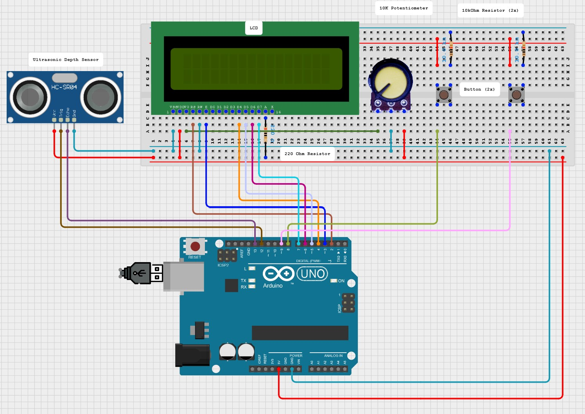
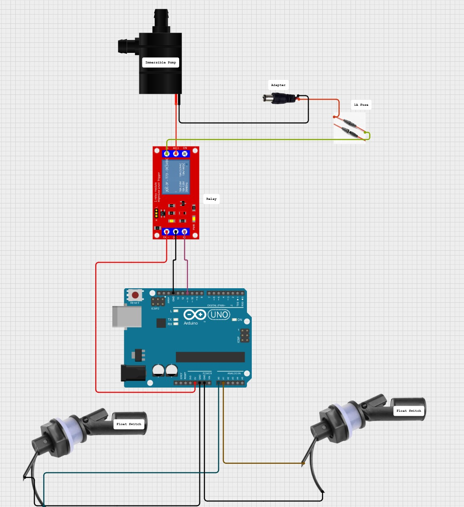
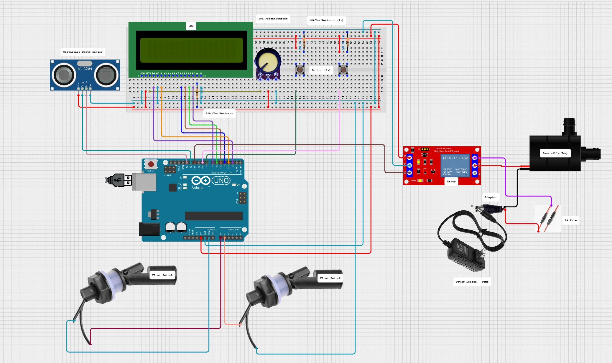

# CyberPlants Automated Hydroponics Solution Maintenance and Monitoring

This repository contains instructions for setting up, maintaining, and monitoring the CyberPlants automated hydroponics system. The system includes hardware components like an ultrasonic depth sensor, immersible pump, and Arduino Uno, and allows for remote data access using Coolterm and TeamViewer.

> **Note**: Skip to [Section 3](#section-3-operating-the-system) if the system is intact and no parts are missing.

### Sections
- [Section 1: Hardware Setup](#section-1-hardware-setup)
- [Section 2: Circuit Diagram](#section-2-circuit-diagram)
- [Section 3: Calibration of Ultrasonic Sensor](./Section3_Calibration/Calibration_Instructions.md)
- [Section 4: System Setup](./Section4_SystemSetup/System_Setup_Instructions.md)
- [Section 5: Software Setup](./Section5_SoftwareSetup/Software_Setup_Instructions.md)

---

## Section 1: Hardware Setup

### Required Components
Ensure you have the following components ready before proceeding:

| Quantity | Component                   |
|----------|-----------------------------|
| 1        | Arduino Uno R3             |
| 1        | Ultrasonic Depth Sensor    |
| 1        | LCD                         |
| 2        | Push Buttons                |
| 1        | Immersible Water Pump       |
| 1        | 5V Relay                    |
| 1        | Power Source for Pump       |
| 2        | Float Switches              |
| 1        | Adaptor                     |
| 1        | 1A Fuse with Fuse Holder    |
| 1        | 10k Potentiometer           |
| 1        | 220 Ohm Resistor            |
| 2        | 10 kOhm Resistor            |

### System Pictures

---

## Section 2: Circuit Diagram

To set up the system, connect the components as shown in the diagrams below.

### Monitoring System Schematic
[](Monitor_Solution_Schematic.jpg)

### Maintaining + Failsafe System Schematic
[](Maintain_Solution_Schematic.jpg)

### Complete System Schematic
[](Total_System_Schematic.jpg)

---

### Written Out Schematic

For a detailed wiring guide, refer to the table below:

<table>
  <thead>
    <tr>
      <th>Component</th>
      <th>Wiring</th>
    </tr>
  </thead>
  <tbody>
    <tr>
      <td>Ultrasonic Sensor</td>
      <td>
        <b>VCC</b> -> 5v<br>
        <b>GND</b> -> GND<br>
        <b>TRIG</b> -> D12<br>
        <b>ECHO</b> -> D13
      </td>
    </tr>
    <tr>
      <td>LCD</td>
      <td>
        <b>VSS</b> -> GND<br>
        <b>VDD</b> -> 5v<br>
        <b>V0</b> -> 10K potentiometer (1st leg)<br>
        <b>RS</b> -> D2<br>
        <b>RW</b> -> GND<br>
        <b>E</b> -> D3<br>
        <b>DB4</b> -> D4<br>
        <b>DB5</b> -> D5<br>
        <b>DB6</b> -> D6<br>
        <b>DB7</b> -> D7<br>
        <b>A (or LED+)</b> -> 220 Ohm resistor -> 5V<br>
        <b>K (or LED-)</b> -> GND
      </td>
    </tr>
    <tr>
      <td>10K Potentiometer</td>
      <td>
        <b>1st leg</b> -> V0<br>
        <b>2nd leg</b> -> GND<br>
        <b>3rd leg</b> -> 5V
      </td>
    </tr>
    <tr>
      <td>Button 1</td>
      <td>
        <b>1st Leg</b> -> 10KOhm resistor -> GND<br>
        <b>2nd Leg</b> -> 5V<br>
        <b>3rd Leg</b> -> D8
      </td>
    </tr>
    <tr>
      <td>Button 2</td>
      <td>
        <b>1st Leg</b> -> 10KOhm resistor -> GND<br>
        <b>2nd Leg</b> -> 5V<br>
        <b>3rd Leg</b> -> D9
      </td>
    </tr>
    <tr>
      <td>Float Switch 1</td>
      <td>
        <b>1st wire</b> -> A0<br>
        <b>2nd wire (or black wire)</b> -> GND
      </td>
    </tr>
    <tr>
      <td>Float Switch 2</td>
      <td>
        <b>1st wire</b> -> A1<br>
        <b>2nd wire (or black wire)</b> -> GND
      </td>
    </tr>
    <tr>
      <td>Pump</td>
      <td>
        <b>Red wire</b> -> COM terminal relay<br>
        <b>Black wire</b> -> Negative terminal adapter
      </td>
    </tr>
    <tr>
      <td>Adapter (connected to outside AC source)</td>
      <td>
        <b>Positive Outlet</b> -> Fuse wire<br>
        <b>Negative Outlet</b> -> Black pump wire
      </td>
    </tr>
    <tr>
      <td>Relay</td>
      <td>
        <b>COM terminal</b> -> Black pump wire<br>
        <b>NC terminal</b> -> Fuse wire<br>
        <b>DC+</b> -> 5V<br>
        <b>DC-</b> -> GND<br>
        <b>IN</b> -> D11
      </td>
    </tr>
  </tbody>
</table>


---
# Section 3: Calibration of Ultrasonic Sensor

## Requirements
- Arduino IDE installed and ready to run.
- For installation instructions, refer to [Arduino IDE Info](https://www.arduino.cc/en/software).

---

## Steps for Calibration

### 1. Initial Code
Upload the following code to your Arduino to measure raw distances:

- Open the Arduino IDE.
- Connect the Arduino board to your computer.
- Paste the code from `Initial_Sensor_Code.ino`.
- Verify (click the checkmark) and upload (click the arrow) to run the system.

You can find the code here: [Initial_Calibration_Code.ino](Initial_Calibration_Code.ino)

---

### 2. Calibration Process
1. Position the sensor at a fixed height above the plant bin.
2. Pour water into the bin in small increments, recording the actual distance and measured distance from the ultrasonic sensor.
3. Repeat this process 3-4 times.
4. Calculate individual correction factors for each measurement:

   \[
   Individual Correction Factor = Actual Distance/Measured Distance
   \]

5. Determine the average correction factor:

   \[
   Correction Factor = AVERAGE(Individual Correction Factors)
   \]

---

### 3. Final Code
After calculating the correction factor, modify the code to include it. Use the file `Calibrated_Sensor_Code.ino` and update the `correctionFactor` variable.

You can find the calibrated code here: [Calibrated_Sensor_Code.ino](./Calibrated_Sensor_Code.ino).

---

### Notes
Ensure that the sensor is securely mounted during calibration for consistent results.

# Section 4: System Setup

## Requirements
- Arduino Uno R3
- AC source for the pump
- Water solution bin and plant bin
- Float Switch 1 (connected to A0 on Arduino)
- Float Switch 2 (connected to A0 on Arduino)
- Arduino IDE installed (instructions [here](https://www.arduino.cc/en/software))

---

## Steps for System Setup

### 1. Plugging in and Preparing Hardware
1. Plug the **Arduino Uno R3** into your laptop.
2. Plug the **AC source for the pump** into an outlet.
3. Insert water into your **solution bin** and **plant bin** as needed.

---

### 2. Float Switch Setup
1. **Float Switch 1**: Place this float switch into the **plant bin** to stop overfill and prevent flooding.
    - Half of the float should be placed at a height where you want the water to stop in case the ultrasonic sensor fails (as a last resort).
    - The float should be above the water.

2. **Float Switch 2**: Place this float switch into the **solution bin** to stop the pump when the solution level gets too low.
    - The float should be immersed in the water.

---

### 3. Upload the Code
1. **Code Setup**: The code [Total_System_Code.ino](Total_System_Code.ino)  is already written, just update the `correctionFactor` on first line of code.
2. Open the **Arduino IDE**.
3. **Verify & Upload**: Connect the Arduino, click the checkmark to verify the code, and then click the arrow to upload it.

---

### 4. LCD and Button Configuration
- After uploading, the **LCD** should light up displaying **"Water Level - Set Min"**.
- **Set MIN and MAX Thresholds**:
    1. Click on the first button (**green button**) to set the **MIN threshold**.
        - MIN is the minimum distance between the ultrasonic sensor and the top of the solution level, which turns off the pump when reached.
        - For example, setting the MIN to **2cm** means the pump will turn off when the solution level is 2cm from the ultrasonic sensor.
        
    2. Click on the second button (**blue button**) to set the **MAX threshold**.
        - MAX is the maximum distance between the ultrasonic sensor and the top of the solution level, which turns on the pump when reached.
        - For example, setting the MAX to **5cm** means the pump will turn on when the solution level reaches 5cm from the ultrasonic sensor.

- **Mode Switch**:
    - Click the second button (**blue button**) to switch the mode.
    - The mode cycles between: **"Setting Min" -> "Setting Max" -> "Monitoring"**.

---

### 5. System Monitoring
Your system is now set up! The pump will trigger based on the thresholds you set to maintain the solution level, and the ultrasonic sensor will monitor the solution continuously.

# Section 5: Software Setup

## Requirements
- **TeamViewer** (for remote access)
- **CoolTerm** (for serial communication with Arduino)
- **Google Sheets or Microsoft Excel** (for data analysis)

---

## Steps for Software Setup

### 1. Download and Setup TeamViewer

#### Mobile Version
1. **Download**: Search for **TeamViewer** in your mobile app store (free download).
2. **Installation**: Follow the steps provided to install TeamViewer on your mobile device.
3. **TeamViewer Mobile App Interface**: After installation, the app should look similar to the following screen.

#### Desktop Version
1. **Download**: Go to [TeamViewer Download Page](https://www.teamviewer.com/en/download/) and scroll down to download **TeamViewer Host**.
2. **Installation**: Follow the installation instructions.
3. **TeamViewer Desktop App Interface**: After installation, the desktop version should show the following screen.

#### Remote Access Setup
1. Open **TeamViewer** on the desktop.
2. Click the link at the bottom that says **“Connect with TeamViewer ID”**.
3. On your mobile device, open the **TeamViewer** app and enter the **Partner ID** shown on your desktop.
4. Press **“Remote Control”** and enter the password when prompted.
5. You should now have full remote access to your desktop from your mobile device.

---

### 2. Download and Setup CoolTerm

1. **Download CoolTerm**:
   - Go to the [CoolTerm Download Website](https://freeware.the-meiers.org/).
   - Scroll down and download the version suitable for your desktop.
   
2. **Install CoolTerm**:
   - Once downloaded, open the CoolTerm installer and follow the installation steps.
   
3. **Connect CoolTerm to Arduino**:
   - Open **CoolTerm**.
   - On the bottom-left corner, where no serial port is selected, click the drop-down arrow to choose the correct **serial port** for your Arduino.
   
4. **Run the Arduino Code**:
   - Open **Arduino IDE** and run the embedded Arduino code for the system.
   
5. **CoolTerm Connection**:
   - In CoolTerm, click **“Connect”** at the top. 
   - If there’s an issue, ensure that the **serial monitor** in Arduino IDE is **not** open.
   - You should start seeing the data being uploaded on CoolTerm.

---

### 3. Data Collection and Analysis

1. **Save Data**:
   - Once the data is being displayed in CoolTerm, save the data to a file.
   - Press **“Connection” -> “Capture to Text/Binary File” -> “Start”** to begin capturing the data.
   - After gathering sufficient data, press **“Stop”** to stop capturing.
   - Save the file using **“Send Text/Binary File…”** to save it locally on your computer.
   
2. **Data Analysis Setup in Google Sheets or Excel**:
   - Open **Google Sheets** or **Microsoft Excel**.
   - Copy the data from the CoolTerm text file and paste it into a column named **“Data”**.
   - Create additional columns with the following headers: **“Time (ms)”, “Solution Level (cm)”, “Pump”, “Adjusted Time (ms)”**.
   
3. **Input Equations**:
   - In the **Time (ms)** column, use the formula:
     ```excel
     =ARRAYFORMULA(IF(A2:A<>"", IFERROR(REGEXEXTRACT(A2:A, "Time: (\d+) ms"), "N/A"), ""))
     ```
   - In the **Solution Level (cm)** column, use:
     ```excel
     =ARRAYFORMULA(IF(A2:A<>"", IFERROR(REGEXEXTRACT(A2:A, "Water Level: (\d+) cm"), "N/A"), ""))
     ```
   - In the **Pump** column, use:
     ```excel
     =ARRAYFORMULA(IF(A2:A<>"", IF(REGEXMATCH(A2:A, "Pump turned on: above max level"), "Pump turned on: above max level", IFERROR(REGEXEXTRACT(A2:A, "Pump: (\w+)"), "N/A")), ""))
     ```
   - In the **Adjusted Time (ms)** column (only needed if your first time value does not start at 0 ms), use:
     ```excel
     =B2-$B$2
     ```

4. **Data Ready**: After inserting the equations, your data should be correctly parsed, and you can begin analyzing it as needed.

---
### 4. Troubleshooting
- Ensure that **CoolTerm** is properly connected to the Arduino via the correct serial port.
- Double-check that the **Arduino IDE**’s serial monitor is closed when using **CoolTerm**.
- If TeamViewer is not connecting properly, verify your internet connection or recheck the TeamViewer ID and password.
- If LCD is turned on but the writing is not visible, toggle with the 10kohm potentiometer knob
- [**Detailed Manual**](https://docs.google.com/document/d/1stZTwr3HXEx61PR2mRrPpaU4MkBGXDxLLtloeoPNF5o/edit?usp=sharing): Look at this manual for more detailed instructions on sections 4 and 5 if you need help.


